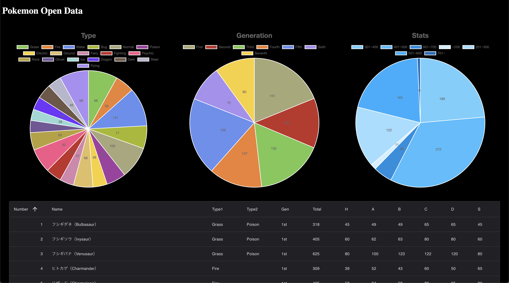

# 🗳️ Pokemon Open Data



The Complete Pokemon Dataset
- https://www.kaggle.com/datasets/rounakbanik/pokemon

## api
⚙ Rust 1.81

Rest API の提供

## database
🐬 MySQL 8.4

## import
⚙ Rust 1.81

オープンデータの取込, migration の管理用
- https://diesel.rs/guides/getting-started

※ schema は使用しない

## client
🪫 Svelte 4.0

# Set Up
```bash
# 環境変数の設定
make setup

# Docker イメージの作成
docker compose build

# Docker コンテナの立ち上げ
docker compose up -d

# 初期データの取り込み
make migrate

# node_modules のインストール
make client-setup

# APIクライアントの生成
make openapi
```

## Developing
```bash
docker compose up -d
```

### API Server
```bash
# cargo run
make api
```

### Client Server
```bash
# bun run
make client
```

# 📒 Note

## MySQL で LOAD DATA する際の設定確認

```sql
-- ファイル読み込みが許可されているか
SELECT @@local_infile;

-- CSVの設置場所を確認する
SELECT @@global.secure_file_priv;
```
